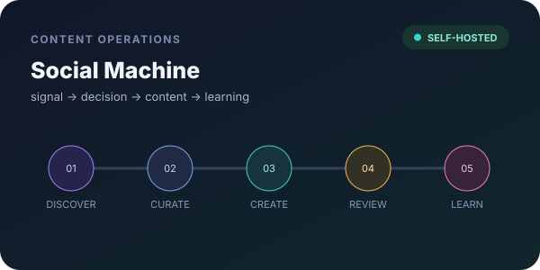
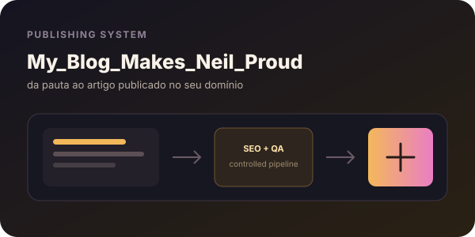
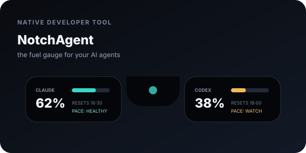
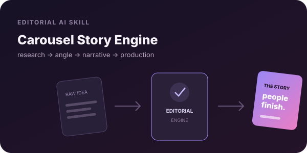
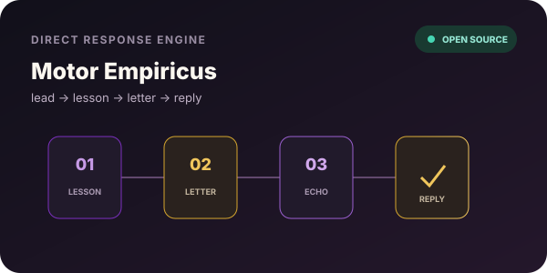
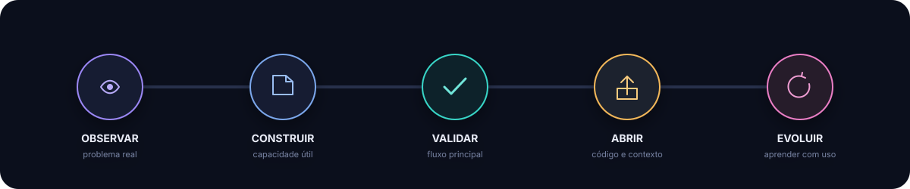

<p align="center">
  <a href="#escolha-seu-ponto-de-entrada">
    
  </a>
</p>

<p align="center">
  <strong>Português</strong>
  ·
  <a href="./README.en.md">English</a>
</p>

<p align="center">
  <a href="#comece-pelo-notchagent"><strong>Instalar NotchAgent</strong></a>
  ·
  <a href="#biblioteca-para-builders"><strong>Usar biblioteca</strong></a>
  ·
  <a href="#veja-em-funcionamento"><strong>Ver demonstrações</strong></a>
  ·
  <a href="#biblioteca-completa"><strong>Abrir catálogo</strong></a>
  ·
  <a href="#projetos-em-destaque"><strong>Ver destaques</strong></a>
  ·
  <a href="#do-problema-ao-produto"><strong>Entender o método</strong></a>
</p>

<p align="center">
  
  
  
  
  
</p>

<h1 align="center">RocketLabs</h1>

<p align="center"><strong>Produtos para explorar. Playbooks open source para reutilizar.</strong></p>

<p align="center">
  Este é o mapa central dos projetos de <a href="https://github.com/luisroquette">@luisroquette</a>.
  Cada projeto vive em seu próprio repositório. Aqui você entende o problema,
  vê o produto em ação e encontra o melhor ponto de entrada. A biblioteca reúne
  o método, os checklists e os templates usados para colocá-los no mundo.
</p>

---

## Comece pelo NotchAgent

<p align="center">
  <a href="https://github.com/luisroquette/notchagent">
    
  </a>
</p>

<p align="center">
  
  
  
  
</p>

**O medidor de combustível dos seus agentes de IA.** O NotchAgent mostra quanto
da sua quota de Claude Code e Codex ainda resta, projeta quando ela pode acabar e
avisa antes de você atingir o limite — direto no notch do MacBook.

```bash
brew install --cask luisroquette/tap/notchagent
```

<p align="center">
  <a href="https://github.com/luisroquette/notchagent#install"><strong>Instalar agora →</strong></a>
  ·
  <a href="https://github.com/luisroquette/notchagent/releases/tag/v1.0.1"><strong>Baixar v1.0.1</strong></a>
  ·
  <a href="https://github.com/luisroquette/notchagent#dados-o-que-é-real-o-que-é-estimado"><strong>Entender os dados</strong></a>
</p>

## Biblioteca para builders

Você não precisa usar um produto RocketLabs para levar algo útil daqui. Esta
biblioteca reúne o processo usado para transformar projetos internos em
repositórios públicos, seguros e compreensíveis.

| Recurso reutilizável | Use para… | Abrir |
|---|---|---|
| 🧭 **Playbook open source** | separar produto, configuração e dados antes de publicar | [Ler playbook](./docs/pt-BR/open-source-playbook.md) |
| 🔐 **Checklist de segurança** | revisar arquivos, histórico Git, infraestrutura e CI | [Executar checklist](./docs/pt-BR/security-checklist.md) |
| 🧱 **Template de README** | apresentar valor, instalação, dados e limitações | [Copiar template](./templates/README.pt-BR.md) |
| 🚀 **Checklist de lançamento** | validar produto, release, distribuição e pós-lançamento | [Preparar lançamento](./docs/pt-BR/launch-checklist.md) |
| 📣 **Playbook de distribuição** | publicar problemas específicos com posts, provas e métricas | [Distribuir projetos](./docs/pt-BR/distribution-playbook.md) |
| 🧩 **Comparativo dos sistemas** | escolher o projeto certo para cada caso de uso | [Comparar projetos](./docs/pt-BR/project-comparison.md) |

<p align="center">
  <a href="./docs/README.md"><strong>Abrir a biblioteca completa →</strong></a>
</p>

## Escolha seu ponto de entrada

| Se você quer… | Comece por |
|---|---|
| Monitorar limites de agentes de IA direto no Mac | **[NotchAgent](https://github.com/luisroquette/notchagent)** |
| Operar conteúdo de ponta a ponta, com controle humano | **[Social Machine for All](https://github.com/luisroquette/social-machine-for-all)** |
| Transformar pautas em artigos SEO no seu próprio domínio | **[Auto-blog Template](https://github.com/luisroquette/autoblog-template)** |
| Criar carrosséis com pesquisa, narrativa e QA editorial | **[Carousel Story Engine](https://github.com/luisroquette/carousel-story-engine)** |
| Conectar agentes a notícias e dados brasileiros de IA | **[SWEN.AI MCP Server](https://github.com/luisroquette/swen-mcp-server)** |

## Veja em funcionamento

<table>
  <tr>
    <td width="50%" valign="top">
      <a href="https://github.com/luisroquette/social-machine-for-all">
        
      </a>
      <p align="center"><strong>Social Machine</strong><br /><sub>Do sinal à aprovação editorial.</sub></p>
    </td>
    <td width="50%" valign="top">
      <a href="https://github.com/luisroquette/notchagent">
        
      </a>
      <p align="center"><strong>NotchAgent</strong><br /><sub>Quota, ritmo e alertas sem sair do desktop.</sub></p>
    </td>
  </tr>
  <tr>
    <td width="50%" valign="top">
      <a href="https://github.com/luisroquette/autoblog-template">
        
      </a>
      <p align="center"><strong>Auto-blog Template</strong><br /><sub>Da pauta ao artigo publicado.</sub></p>
    </td>
    <td width="50%" valign="top">
      <a href="https://github.com/luisroquette/carousel-story-engine">
        
      </a>
      <p align="center"><strong>Carousel Story Engine</strong><br /><sub>Da ideia bruta à narrativa pronta.</sub></p>
    </td>
  </tr>
</table>

<p align="center"><sub>Previews dos próprios projetos. Clique em qualquer demonstração para ver requisitos, instalação e limitações.</sub></p>

## Projetos em destaque

<table>
  <tr>
    <td width="50%" valign="top">
      <a href="https://github.com/luisroquette/social-machine-for-all">
        
      </a>
      <h3>Social Machine for All</h3>
      <p>Um sistema self-hosted para descobrir sinais, criar, revisar, publicar e aprender com conteúdo — mantendo marca, dados e decisões sob seu controle.</p>
      <p><strong>Next.js · Supabase · AI agents</strong></p>
      <a href="https://github.com/luisroquette/social-machine-for-all"><strong>Explorar o projeto →</strong></a>
    </td>
    <td width="50%" valign="top">
      <a href="https://github.com/luisroquette/autoblog-template">
        
      </a>
      <h3>Auto-blog Template</h3>
      <p>Infraestrutura open source para levar uma pauta até um artigo publicado, com perfil editorial, SEO, controle de execução e dados próprios.</p>
      <p><strong>Next.js · Supabase · SEO</strong></p>
      <a href="https://github.com/luisroquette/autoblog-template"><strong>Explorar o projeto →</strong></a>
    </td>
  </tr>
  <tr>
    <td width="50%" valign="top">
      <a href="https://github.com/luisroquette/notchagent">
        
      </a>
      <h3>NotchAgent</h3>
      <p>O medidor de combustível dos seus agentes de IA no notch do MacBook: limites, ritmo de consumo e alertas, com arquitetura local-first.</p>
      <p><strong>Swift 6 · SwiftUI · macOS</strong></p>
      <a href="https://github.com/luisroquette/notchagent"><strong>Instalar ou ver o código →</strong></a>
    </td>
    <td width="50%" valign="top">
      <a href="https://github.com/luisroquette/carousel-story-engine">
        
      </a>
      <h3>Carousel Story Engine</h3>
      <p>Uma skill portátil que transforma uma ideia bruta em carrossel baseado em evidências, com pesquisa, disputa de hooks e QA editorial.</p>
      <p><strong>AI skill · Research · Editorial QA</strong></p>
      <a href="https://github.com/luisroquette/carousel-story-engine"><strong>Usar a skill →</strong></a>
    </td>
  </tr>
  <tr>
    <td colspan="2" valign="top">
      <a href="https://github.com/luisroquette/motor-empiricus">
        
      </a>
      <h3>Motor Empiricus</h3>
      <p align="center">
        <a href="https://github.com/luisroquette/motor-empiricus/blob/main/assets/output-weekly-digest.png"></a>
        <a href="https://github.com/luisroquette/motor-empiricus/blob/main/assets/output-editorial-lesson.png"></a>
        <a href="https://github.com/luisroquette/motor-empiricus/blob/main/assets/output-campaign-letter.png"></a>
      </p>
      <p>Um sistema portátil de nutrição que organiza aulas, cartas e repiques em uma cadência de conversão com claims verificáveis, templates instaláveis e validação determinística.</p>
      <p><strong>AI skill · Lifecycle email · Compliance</strong></p>
      <a href="https://github.com/luisroquette/motor-empiricus#quick-start"><strong>Instalar o motor →</strong></a>
    </td>
  </tr>
</table>

## Biblioteca completa

<!-- PROJECTS:START -->
| Projeto | O que resolve | Categoria | Estado | Uso |
|---|---|---|---|---|
| [NotchAgent](https://github.com/luisroquette/notchagent) | Quotas e burn rate de agentes de IA no notch do Mac. | Developer tools | 🟢 Ativo | Código público |
| [Social Machine for All](https://github.com/luisroquette/social-machine-for-all) | Operação de conteúdo self-hosted, do sinal ao aprendizado. | Content systems | 🟢 Ativo | [MIT](https://github.com/luisroquette/social-machine-for-all/blob/HEAD/LICENSE) |
| [Auto-blog Template](https://github.com/luisroquette/autoblog-template) | Pipeline replicável de pauta, SEO e publicação. | Publishing | 🟢 Ativo | [MIT](https://github.com/luisroquette/autoblog-template/blob/HEAD/LICENSE) |
| [Carousel Story Engine](https://github.com/luisroquette/carousel-story-engine) | Carrosséis com pesquisa, narrativa e controle editorial. | AI skills | 🟢 Ativo | [MIT](https://github.com/luisroquette/carousel-story-engine/blob/HEAD/LICENSE) |
| [Motor Empiricus](https://github.com/luisroquette/motor-empiricus) · [demo](https://github.com/luisroquette/motor-empiricus#what-it-produces) | Nutrição de leads com aulas, cartas, repiques e validação de claims. | Lifecycle marketing | 🟢 Ativo | [MIT](https://github.com/luisroquette/motor-empiricus/blob/HEAD/LICENSE) |
| [SWEN.AI MCP Server](https://github.com/luisroquette/swen-mcp-server) | Dados públicos de IA brasileira para agentes via MCP. | AI infrastructure | 🔵 Referência | [MIT](https://github.com/luisroquette/swen-mcp-server/blob/HEAD/LICENSE) |
| [GaussMob](https://github.com/luisroquette/gaussmob-nextjs) | Portal para um ecossistema de mobilidade elétrica. | Web products | 🟡 Em evolução | Código público |
| [Coesa Auditoria](https://github.com/luisroquette/coesa-auditoria) · [demo](https://coesa-auditoria.vercel.app) | Experiência web para auditoria de faturas de energia. | Web products | 🟡 Em evolução | Código público |
<!-- PROJECTS:END -->

Os estados descrevem manutenção, não qualidade: **ativo** recebe evolução contínua;
**em evolução** ainda está sendo lapidado; **referência** documenta uma implementação
ou serviço existente. **Código público** permite leitura e estudo, mas não concede
automaticamente permissão de reuso; sempre consulte a licença do projeto.

## Do problema ao produto

<p align="center">
  
</p>

1. **Observar** — partir de um problema real e específico.
2. **Construir** — transformar o fluxo em software, skill ou infraestrutura.
3. **Validar** — testar o caminho principal e declarar limites honestamente.
4. **Abrir** — publicar código, documentação e uma porta de entrada clara.
5. **Evoluir** — aprender com o uso e alimentar a próxima versão.

## Como este laboratório funciona

- **Cada projeto é independente.** Você baixa apenas o que precisa.
- **O catálogo é a fonte de navegação.** O arquivo [`projects.json`](./projects.json) guarda a lista canônica.
- **O catálogo não depende de chaves.** Cada projeto documenta separadamente suas variáveis e integrações.
- **Sem promessas inventadas.** Demos conceituais são identificadas e limitações ficam visíveis.
- **Licença explícita.** Código público só pode ser reutilizado quando a licença permitir.

### Adicionar ou atualizar um projeto

Edite [`projects.json`](./projects.json) e execute:

```bash
node scripts/render-readme.mjs
node scripts/validate-catalog.mjs
```

O primeiro comando atualiza as tabelas em português e inglês. O segundo impede
links duplicados, campos inválidos e imagens ausentes.

## Segurança e suporte

- Encontrou uma possível vulnerabilidade? Siga a política de [`SECURITY.md`](./SECURITY.md) e não publique segredos em issues.
- Precisa entender o nível de suporte? Leia [`SUPPORT.md`](./SUPPORT.md).
- Problemas de um produto devem ser relatados no repositório daquele produto.

O RocketLabs é um catálogo gratuito mantido em melhor esforço. Não há SLA,
garantia de compatibilidade nem suporte individual obrigatório.

## Princípios

> IA só é útil quando vira uma capacidade confiável nas mãos de alguém.

O RocketLabs prioriza autonomia, utilidade concreta, documentação honesta,
arquitetura compreensível e controle de dados. Nem todo experimento vira produto;
os que aparecem aqui já têm algo real para explorar, instalar ou estudar.

## Acompanhe

Se algum projeto resolver um problema seu:

1. Abra o repositório e veja a demonstração.
2. Leia os requisitos e limites.
3. Dê uma ⭐ para conseguir encontrá-lo depois.
4. Se houver um problema reproduzível, abra uma issue no projeto correto.

As métricas agregadas de descoberta são preservadas no
[histórico semanal de tráfego](./metrics/README.md).

<p align="center">
  <strong>Construa algo útil. Torne-o compreensível. Coloque-o no mundo.</strong>
</p>

<p align="center">
  <a href="https://github.com/luisroquette">GitHub</a>
  ·
  <a href="./LICENSE">MIT</a>
  ·
  <a href="./CONTRIBUTING.md">Contribuir</a>
  ·
  <a href="./SECURITY.md">Segurança</a>
  ·
  <a href="./SUPPORT.md">Suporte</a>
</p>
